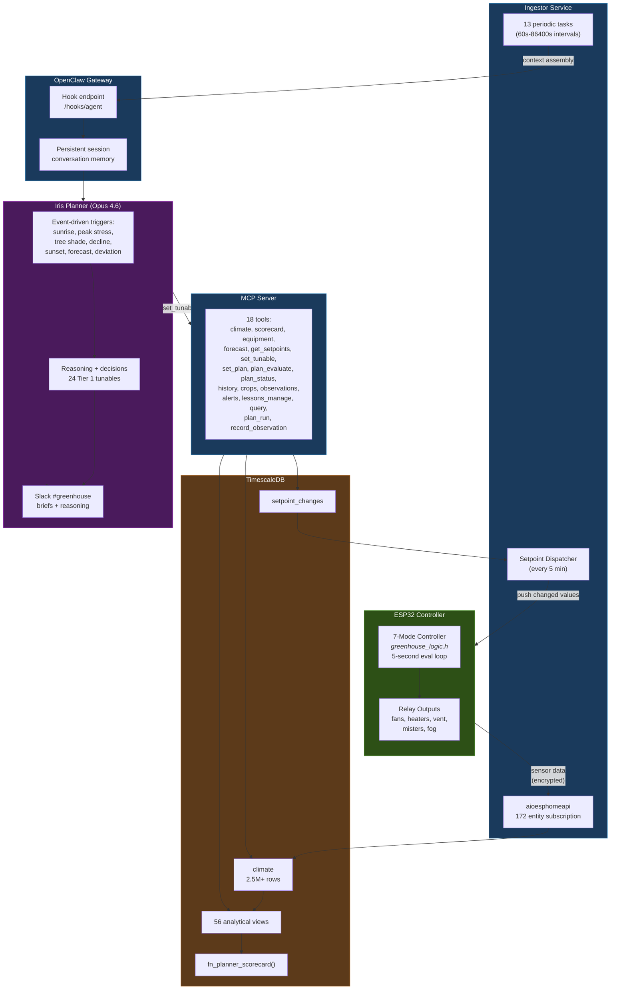
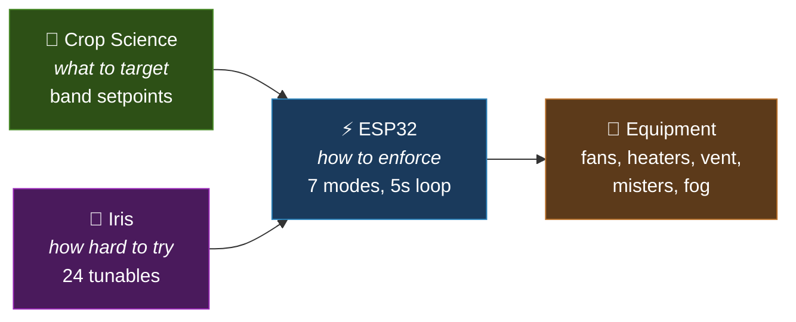
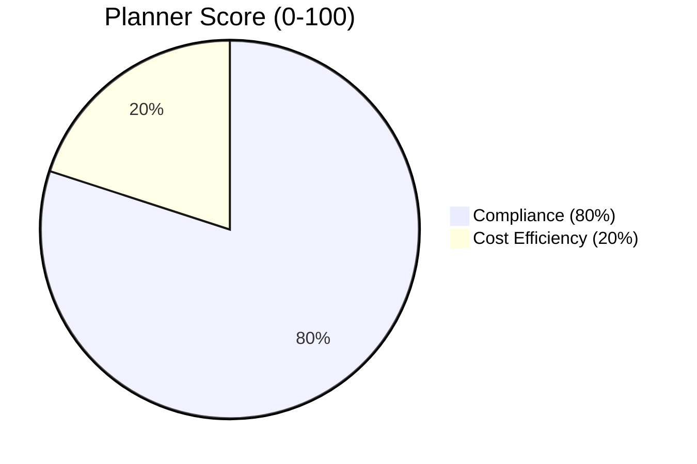

# System Architecture

Everything runs on a single VM. No cloud infrastructure. The only external dependencies are API keys for the AI models. The greenhouse operates autonomously — if the AI goes offline, the ESP32 keeps the last setpoints and runs on its own.

## The Complete Loop

## Three Layers

The system has three distinct control layers, each with a different time scale and responsibility:

### Layer 1: Crop Target Band (minutes)
Computed from the diurnal profiles of all active crops. Sets temp_low, temp_high, vpd_low, vpd_high every 5 minutes. Night: 62-65°F. Peak day: 72-78°F. The ESP32's mode thresholds follow the band automatically. Plant science defines what conditions the greenhouse should target.

### Layer 2: Iris Planner (hours)
An AI agent (Claude Opus 4.6) responds to solar milestones and environmental changes. Iris adjusts 24 Tier 1 tunables that shape how aggressively the controller responds: hysteresis widths, mister timing, fog thresholds, thermal biases. The planner decides how hard the system tries given the weather forecast. Every decision is posted to #greenhouse in Slack with reasoning.

### Layer 3: ESP32 Mode Controller (seconds)
7 priority-ordered modes evaluated every 5 seconds. Pure C++ (`greenhouse_logic.h`) compiles identically on ESP32 and x86. The mode controller enforces the band + tunables with physical equipment. If the AI goes offline, the ESP32 keeps its last setpoints.

## Event-Driven Planning

Instead of running on a fixed schedule, Iris responds to natural transition points in the greenhouse day. The ingestor computes solar milestones from ephemeris data each morning.

```mermaid
gantt
    title Iris Planning Events (typical spring day)
    dateFormat HH:mm
    axisFormat %H:%M

    section Events
    Sunrise (morning brief)         :milestone, 06:28, 0m
    Peak Stress (max aggression)    :milestone, 15:01, 0m
    Tree Shade (reduce misting)     :milestone, 17:01, 0m
    Decline (evening transition)    :milestone, 18:34, 0m
    Sunset (evening brief)          :milestone, 19:34, 0m

    section Reactive
    Forecast changes                :active, 06:00, 20:00
    Deviation alerts                :crit, 06:00, 20:00
```

**Sunrise and sunset** produce full planning briefs — yesterday's scorecard, today's forecast, tunable adjustments with reasoning. **Transitions** are brief — Iris checks conditions and adjusts only if needed. **Deviations** trigger immediate response when observed conditions diverge from forecast.

## Data Pipeline

172 sensor entities flow from the ESP32 through encrypted native API into TimescaleDB at sub-minute freshness:

| Source | Transport | Destination | Rate |
|--------|-----------|-------------|------|
| ESP32 sensors | aioesphomeapi (encrypted) | climate table | ~2s |
| ESP32 relays | aioesphomeapi | equipment_state table | on change |
| ESP32 mode | aioesphomeapi | system_state table | on change |
| Tempest weather | HA REST (transitional) | climate outdoor columns | 5 min |
| Open-Meteo forecast | HTTP API | weather_forecast table | 1 hour |
| Sentinel cameras | MQTT | occupancy → ESP32 | on change |
| Iris planner | MCP set_tunable() | setpoint_changes table | on event |
| Dispatcher | aioesphomeapi push | ESP32 tunables | 5 min |

## Planner Score (KPI)

Performance is measured by an automated composite score:

- **Compliance** = % of day with temp AND VPD inside crop band. Target: >90%.
- **Cost efficiency** = daily utility spend. <$5/day = full marks, $15+ = zero.
- **Stress hours** tracked as 4 independent states: heat, cold, VPD-high, VPD-low.
- Iris reviews the scorecard at every sunrise and sunset event.

## Physical Constraints

| Parameter | Value | Impact |
|-----------|-------|--------|
| Floor area | 367 sq ft | Elongated hexagon, 6 distinct microclimates |
| Elevation | 5,090 ft | 17% less air density, extreme VPD in spring |
| Solar gain | ~87,000 BTU/hr peak | Drives all thermal behavior |
| Cooling capacity | ~34,000-39,000 BTU/hr | 40% overstated due to altitude + undersized vent |
| Cooling deficit | ~49,000 BTU/hr | Physics-limited above 85°F without shade cloth |
| Intake vent | 24"x24" (4 sq ft) | Critically undersized for 4,900 CFM |
| AquaFog | 800W, 7× mister effectiveness | Centrifugal atomizer, 4-25μm droplets |
| Gas heater | 54,000 BTU/hr actual | Altitude-derated 20%, 3.9× cheaper than electric |
| Slab thermal mass | ~7,300 BTU/°F | 11.5h time constant, 7-10°F overnight retention |

The system doesn't pretend these limits don't exist. The AI knows the cooling deficit. It knows fog is 7× more effective than misters. It plans around physics, not through it.

---

**Deeper dives:** [The Planning Loop](/intelligence/planning/) · [ESP32 Controller](/climate/controller/) · [Lessons Learned](/intelligence/lessons/)
