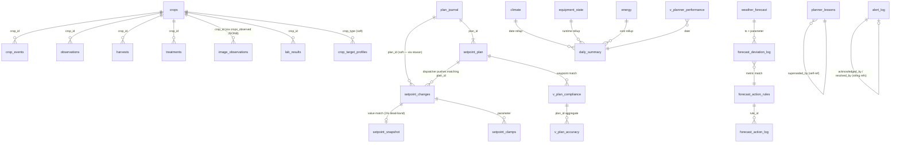

# Schema Relationships

Pydantic models in `verdify_schemas/` are intentionally standalone — no cross-imports between models, no `ForeignKey` fields, no nested model-refs beyond what one row needs on its own. The relationships below are **documented**, not enforced at the schema level.

## Why document, don't enforce

Enforcing FK relationships in Pydantic would mean one of:

1. **Embedded refs:** `CropEvent.crop: Crop` — forces every consumer that wants a `CropEvent` to also hydrate the parent `Crop`. Over-fetches on the common "just show the event" case, and pulls every model file into every other file's import graph. Circular-import hell.
2. **ID-typed references with runtime resolvers:** `CropEvent.crop_id: Annotated[int, MustExist(Crop)]` — requires a live DB connection at validation time. Schemas are supposed to be pure — they describe shape, not liveness. Every test that constructs a fake `CropEvent` would need to stand up a Postgres.
3. **String-ref placeholders:** `crop_id: int  # FK → crops.id` — this is just a comment.

We already have the real constraint system: **Postgres itself.** Every FK listed below is a real `REFERENCES` declaration in the DB (or a soft join on a well-known column name). The DB rejects orphan rows; the Pydantic layer handles shape. Stop mixing the two.

## The relationship map



## Canonical FK table

Hard constraints (DB-enforced `REFERENCES` clauses):

| Parent | Child | FK column | Cascade |
|---|---|---|---|
| `crops.id` | `crop_events.crop_id` | `crop_id` | no |
| `crops.id` | `observations.crop_id` | `crop_id` | no |
| `crops.id` | `harvests.crop_id` | `crop_id` | no |
| `crops.id` | `treatments.crop_id` | `crop_id` | no |
| `crops.id` | `lab_results.crop_id` | `crop_id` | no |
| `observations.id` | `treatments.observation_id` | `observation_id` | no |
| `image_observations.id` | `observations.image_observation_id` | `image_observation_id` | no |
| `greenhouses.id` | everywhere | `greenhouse_id` | no |
| `planner_lessons.id` | `planner_lessons.superseded_by` | self-ref | no |
| `forecast_action_rules.id` | `forecast_action_log.rule_id` | `rule_id` | no |
| `irrigation_schedule.id` | `irrigation_log.schedule_id` | `schedule_id` | no |

Soft relationships (no FK; joins happen by well-known column matching):

| Parent | Child | Join column | Notes |
|---|---|---|---|
| `plan_journal.plan_id` | `setpoint_plan.plan_id` | `plan_id` | 1:N — every plan has 10-30 waypoints |
| `plan_journal.plan_id` | `setpoint_changes` | `reason` (substring) | planner encodes plan_id in the `reason` text |
| `setpoint_changes.parameter,ts` | `setpoint_snapshot.parameter,ts` | value match w/ 1% dead-band | FW-4 confirmation loop |
| `setpoint_changes.parameter` | `setpoint_clamps.parameter` | `parameter` | audit trail when planner values got clamped |
| `climate.ts`, `equipment_state.ts`, `energy.ts` | `daily_summary.date` | date bucket | nightly snapshot script rolls these up |
| `weather_forecast.ts,parameter` | `forecast_deviation_log.ts,parameter` | time+parameter match | hourly comparison |
| `override_events.override_type` | `v_override_activity_24h.override_type` | group by | view-only rollup |
| `setpoint_clamps.parameter` | `v_clamp_activity_24h.parameter` | group by | view-only rollup |
| `crop_events.event_type` | `CropEventType` literal | string | 10 valid types per `verdify_schemas/crops.py` |
| `alert_log.alert_type` | (no enum) | string | ~15 types in use; see alerts.py for severity enum |

## Self-referential chains

- **`planner_lessons.superseded_by`** → another `planner_lessons.id`. When a newer lesson replaces an older one, the old row sets `is_active=false` and `superseded_by` points to the new id. Follow the chain forward to find the currently-canonical form.
- **`alert_log.acknowledged_by` / `resolved_by`** → string operator name (not an FK to a users table; there isn't one). Values seen: `iris`, `jason`, `system`, `api`.

## View projections (many-to-one rollups)

Each view in `verdify_schemas/views.py` is a projection of one or more tables:

| View | Source tables | Projection key |
|---|---|---|
| `v_planner_performance` | `daily_summary`, `v_plan_compliance` | `date` |
| `v_plan_compliance` | `setpoint_plan`, `climate` | `planned_ts`, `parameter` |
| `v_plan_accuracy` | `v_plan_compliance` | `plan_id` |
| `v_dew_point_risk` | `climate` | `date` (24h aggregate of margin) |
| `v_water_budget` | `irrigation_log`, `equipment_state` (mister runtime) | `date` |
| `v_daily_oscillation` | `equipment_state` | `date`, `equipment` |
| `v_override_activity_24h` | `override_events` | 24h window |
| `v_clamp_activity_24h` | `setpoint_clamps` | 24h window |

## Embedding the model inventory

Every model file in `verdify_schemas/` declares its DB table (or view/API envelope) in the module docstring. When in doubt:

```bash
grep -l "table row\|response envelope\|view row" verdify_schemas/*.py
```

gives the complete list.

## Follow-ups (Sprint 23+)

- Generate the Mermaid ERD above automatically from `information_schema.table_constraints` so it can't drift from reality. (Today: hand-maintained.)
- Add a `test_relationships.py` that walks every FK listed here and confirms both (a) the declared parent column exists and (b) every child row's parent exists. Makes the soft-ref rows hard.
- Consider an `Annotated[int, FKToCropId]` marker type that's a compile-time comment but a runtime no-op — documents intent in the model without re-introducing the circular-import problem.
